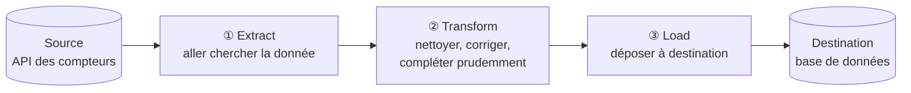

# Introduction : c'est quoi, un ETL ?

Ce document explique les concepts de base avant de regarder la moindre ligne de code.
Si vous savez déjà ce qu'est un ETL, Kafka, ou un "consumer", vous pouvez passer
directement à [02-architecture.md](02-architecture.md).

## Le problème que ça résout

Imaginez que vous devez surveiller la consommation électrique de plusieurs centaines de
bâtiments (bureaux, usines, hôpitaux...). Chaque bâtiment a des compteurs qui mesurent en
continu la puissance consommée, la tension, le courant, la température, etc. Ces mesures
existent quelque part (ici, derrière une API web), mais pour pouvoir les analyser,
les afficher sur un tableau de bord ou déclencher des alertes, il faut les **récupérer**,
les **nettoyer**, et les **stocker** dans une base de données organisée.

C'est exactement ce que fait un ETL : un programme qui déplace de la donnée d'un endroit
à un autre, en la transformant au passage.

## ETL = Extract, Transform, Load

C'est un sigle anglais qui décrit trois étapes que ce type de programme effectue,
toujours dans le même ordre :

| Étape | Anglais | Ce que ça veut dire ici |
|---|---|---|
| **E**xtraction | Extract | Aller chercher la donnée à sa source — ici, interroger l'API qui simule les compteurs électriques. |
| **T**ransformation | Transform | Nettoyer, corriger, mettre en forme la donnée — ici, convertir les horodatages en UTC et reconstruire prudemment les valeurs manquantes. |
| **C**hargement | Load | Déposer la donnée à sa destination finale — ici, la publier sur un bus de messages, pour qu'elle finisse dans une base de données. |

Dans le code de ce dépôt, vous retrouverez d'ailleurs très exactement ces trois mots
comme noms de dossiers : `extract/`, `transform/`, `load/`.



## Pourquoi ne pas écrire directement en base de données ?

On pourrait imaginer un programme qui va chercher la donnée sur l'API et l'écrit
directement dans PostgreSQL. Ce projet fait un détour supplémentaire : entre le
collecteur (qui fait E+T+L vers un bus) et la base de données, il y a un intermédiaire
appelé **Kafka**. Voici pourquoi ce détour est utile :

- **Découpler les deux bouts de la chaîne.** Le programme qui va chercher la donnée
  (le "collecteur") n'a pas besoin de savoir comment ni où elle est stockée in fine.
  Il dépose juste ses messages sur le bus. Un ou plusieurs autres programmes (les
  "consumers") viennent les relire à leur rythme et les écrivent en base.
- **Ne rien perdre si un maillon tombe en panne.** Si la base de données est
  momentanément indisponible, les messages restent stockés sur le bus en attendant
  qu'un consumer vienne les lire. Rien n'est perdu.
- **Brancher plusieurs consommateurs indépendants sur le même flux.** Dans ce projet,
  deux consumers différents lisent le même flux de messages : l'un écrit les mesures
  et les sites en base pour l'historique, l'autre écrit les alertes. Ils sont
  indépendants l'un de l'autre et peuvent tomber en panne ou redémarrer séparément.

## Vocabulaire du bus de messages (Kafka)

Kafka est un outil dont le rôle est de faire transiter des messages entre programmes,
de façon fiable et durable. Quelques mots qui reviendront tout du long :

- **Message** : une information ponctuelle envoyée sur le bus — ici, par exemple,
  "voici la mesure du site SITE002 à 14h32".
- **Topic** (« sujet » / « rubrique ») : une file d'attente nommée sur laquelle les
  messages d'une même nature sont déposés. Dans ce projet, il y a un topic par type de
  donnée : un pour les sites, un pour les mesures brutes, un pour les mesures
  reconstruites, un pour les alertes.
- **Producer** (« producteur ») : le programme qui dépose des messages sur un topic.
  Ici, c'est le collecteur (`enervision-etl`).
- **Consumer** (« consommateur ») : le programme qui lit les messages d'un topic. Ici,
  ce sont les deux services `enervision-consumer`.
- **Consumer group** (« groupe de consommateurs ») : une étiquette qui dit à Kafka
  "ces programmes-là lisent ensemble le même flux, mais chacun ne doit voir chaque
  message qu'une seule fois". Deux consumers dans deux groupes différents reçoivent
  chacun une copie complète des messages ; deux consumers dans le même groupe se
  partagent les messages entre eux (chacun n'en voit qu'une partie). C'est pour ça que
  ce projet donne un groupe distinct à chacun des deux consumers : ils ont besoin de
  voir *chacun* la totalité du flux du référentiel des sites.

  ```mermaid
  flowchart LR
      subgraph deux["Deux groupes distincts : chacun voit TOUT le flux"]
          direction LR
          T1(["Topic"]) --> A1["Consumer A<br/>groupe 1"]
          T1 --> A2["Consumer B<br/>groupe 2"]
      end

      subgraph un["Même groupe : le flux est PARTAGÉ entre eux"]
          direction LR
          T2(["Topic"]) --> B1["Consumer C<br/>groupe 3"]
          T2 --> B2["Consumer D<br/>groupe 3"]
      end
  ```

  *C'est le schéma de gauche qui s'applique à `consume-persistence` et
  `consume-alerting` : deux groupes différents, chacun avec sa vue complète du
  référentiel des sites.*
- **Offset** : la position de lecture d'un consumer sur un topic — un peu comme un
  marque-page. Un consumer qui redémarre reprend là où il s'était arrêté, à condition
  d'avoir "acquitté" (validé, en anglais *commit*) sa lecture au fur et à mesure.
- **Partition** et **clé de partition** : Kafka découpe un topic en plusieurs
  partitions pour paralléliser la lecture et l'écriture. Les messages qui partagent la
  même clé de partition (ici, l'identifiant du site) atterrissent toujours dans la même
  partition et y restent donc **dans leur ordre d'émission**. C'est ce qui garantit que
  les mesures d'un même site sont toujours lues dans le bon ordre chronologique, même si
  Kafka ne garantit rien entre deux sites différents, ni entre deux topics différents.

  ```mermaid
  flowchart LR
      m1["msg SITE_A · 14:00"] --> P0
      m2["msg SITE_A · 14:01"] --> P0
      m3["msg SITE_B · 14:00"] --> P1

      subgraph Topic["Topic measure_raw"]
          P0["Partition 0<br/>(clé = SITE_A)<br/>ordre garanti : 14:00 → 14:01"]
          P1["Partition 1<br/>(clé = SITE_B)"]
      end
  ```

## Vocabulaire du projet

- **Réleve** / **mesure** (*reading*) : une lecture instantanée d'un compteur, à un
  instant donné (consommation, tension, température...).
- **Site** : un bâtiment équipé de compteurs (bureau, usine, hôpital, datacenter,
  magasin).
- **Référentiel des sites** : la liste de tous les sites et de leurs caractéristiques
  fixes (nom, capacité, statut...).
- **Donnée brute** (*raw*) : la mesure exactement telle que renvoyée par l'API, y
  compris ses valeurs manquantes.
- **Imputation** : la reconstruction prudente d'une valeur manquante, en se basant sur
  les mesures voisines (voir [03-modele-de-donnees.md](03-modele-de-donnees.md) pour le
  détail).
- **Collecte temps réel** (*realtime*) : interroger l'API à intervalle régulier pour
  suivre le parc en direct.
- **Rattrapage historique** (*backfill*) : rejouer une période passée d'un site donné,
  par exemple pour remplir un trou après une panne.

Muni de ce vocabulaire, vous pouvez passer à
[02-architecture.md](02-architecture.md) pour voir comment tout ça s'assemble dans ce
projet précis.
