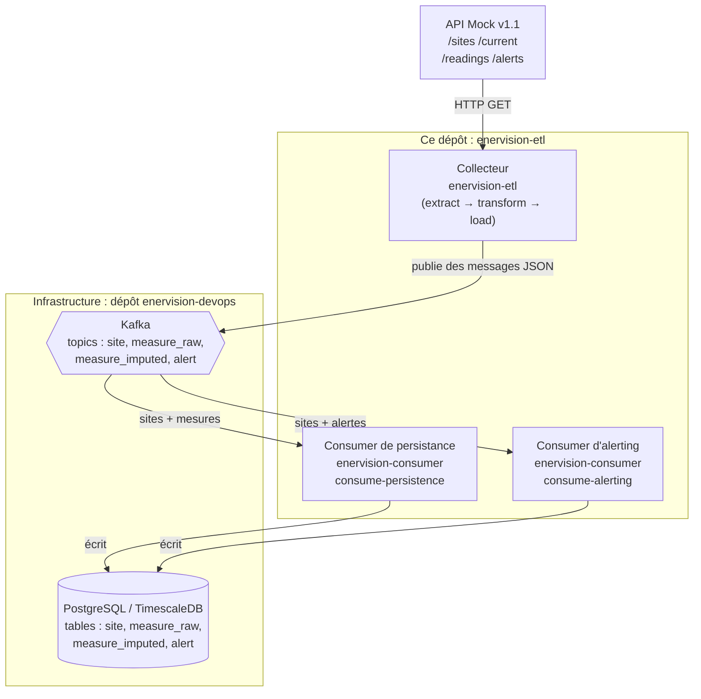
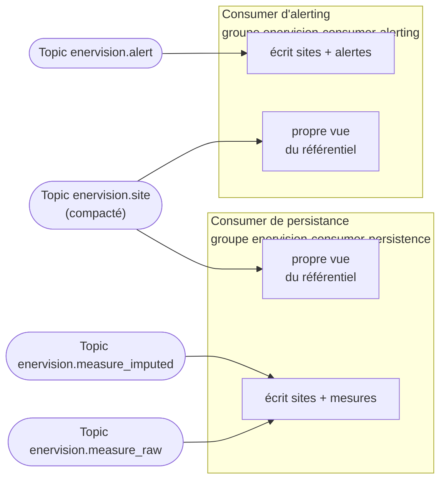

# Architecture du projet

## Vue d'ensemble

*Lecture du schéma : l'API Mock est une source externe. Le collecteur et les deux
consumers sont le code de **ce dépôt**. Kafka et la base de données sont de
l'infrastructure, déclarée ailleurs (voir plus bas).*

## Un dépôt, deux services distincts

Ce dépôt contient le code de **deux extrémités** de la chaîne, mais elles restent deux
services distincts à l'exécution : deux conteneurs Docker différents, deux "consumer
groups" Kafka différents (voir [01-introduction-etl.md](01-introduction-etl.md) pour ce
terme). Rien n'empêche de les déployer sur des machines différentes.

Pourquoi les avoir mis dans le même dépôt de code, alors ? Parce que le **contrat de
message** — le format exact des données échangées sur Kafka — est partagé entre les
deux bouts. Si on avait mis le collecteur dans un dépôt et les consumers dans un autre,
faire évoluer ce format aurait demandé deux changements coordonnés, dans deux dépôts,
avec le risque qu'un déploiement décalé fasse tourner un producteur et un consommateur
qui ne parlent plus tout à fait le même langage. En les gardant ensemble, faire évoluer
le contrat et ses deux implémentations tient en une seule modification.

Ce contrat partagé vit dans un troisième package : `enervision_contracts`. Voir
[03-modele-de-donnees.md](03-modele-de-donnees.md).

## Les trois "rôles" exécutables

Le dépôt produit une seule image Docker, mais elle sait jouer trois rôles différents
selon la commande passée au démarrage du conteneur :

| Rôle | Commande | Package | Rôle métier |
|---|---|---|---|
| Collecteur | `enervision-etl collect-realtime` | `enervision_etl` | Interroge l'API en continu, publie sur Kafka. |
| Collecteur (rattrapage) | `enervision-etl backfill` | `enervision_etl` | Rejoue l'historique d'un site précis. |
| Consumer de persistance | `enervision-consumer consume-persistence` | `enervision_consumer` | Écrit les sites et les mesures en base. |
| Consumer d'alerting | `enervision-consumer consume-alerting` | `enervision_consumer` | Écrit les alertes en base. |

## Ce qui n'est *pas* dans ce dépôt

Kafka (le broker) et PostgreSQL/TimescaleDB (la base de données) sont de
l'**infrastructure** : ils ne sont pas définis ici, mais dans un dépôt séparé,
`enervision-devops`, avec le fichier `compose/etl.yml` qui assemble tous les services
du projet EnerVision. Ce dépôt-ci ne contient que le code applicatif qui *parle* à
cette infrastructure.

## Pourquoi quatre topics et pas un seul ?

Chaque topic Kafka porte le nom de la table qu'il alimente, préfixé par le domaine :
`enervision.site`, `enervision.measure_raw`, `enervision.measure_imputed`,
`enervision.alert`. Un message trouve donc sa destination sans qu'il soit nécessaire de
consulter une documentation séparée : le nom du topic *est* la documentation.

Le topic des sites (`enervision.site`) a une particularité : il doit être créé avec une
politique de **compaction** (`cleanup.policy=compact`). Un topic normal conserve tous
les messages qui y ont été déposés, dans l'ordre, comme un journal. Un topic compacté ne
garde que le **dernier** message pour chaque clé (ici, chaque `site_id`) : c'est adapté
à une donnée qui décrit un état courant ("ce site a telle capacité, tel statut, à cet
instant") plutôt qu'une suite d'événements. Voir
la section *"site_registry_publisher.py"* de [04-collecteur.md](04-collecteur.md) pour le détail
de comment le collecteur exploite cette propriété pour ne rediffuser un site que
lorsqu'il change réellement.

## Pourquoi deux consumers séparés lisent-ils tous les deux le topic des sites ?

`site_id` est une clé étrangère à la fois dans les tables de mesures et dans la table
des alertes. Chaque consumer doit donc pouvoir résoudre cette clé étrangère de son
côté, sans dépendre de l'autre service. Rien ne garantit que le consumer de persistance
ait déjà traité le référentiel au moment où le consumer d'alerting en a besoin (et
inversement) : chacun tient donc sa **propre** vue du référentiel des sites, obtenue en
lisant lui-même le topic compacté. Voir
la section *"consumption_loop.py"* de [05-consumers.md](05-consumers.md) pour le
mécanisme exact.

*Les deux consumers lisent le même topic des sites, chacun dans son propre groupe : ni
l'un ni l'autre ne dépend de la progression de l'autre pour résoudre `site_id`.*

## Suite

- [03-modele-de-donnees.md](03-modele-de-donnees.md) — les objets échangés et la règle
  de non-destruction des valeurs nulles.
- [04-collecteur.md](04-collecteur.md) — le détail du service `enervision-etl`.
- [05-consumers.md](05-consumers.md) — le détail des services `enervision-consumer`.
