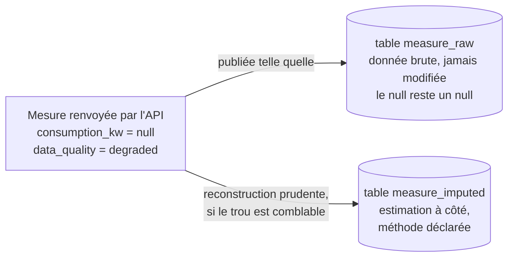
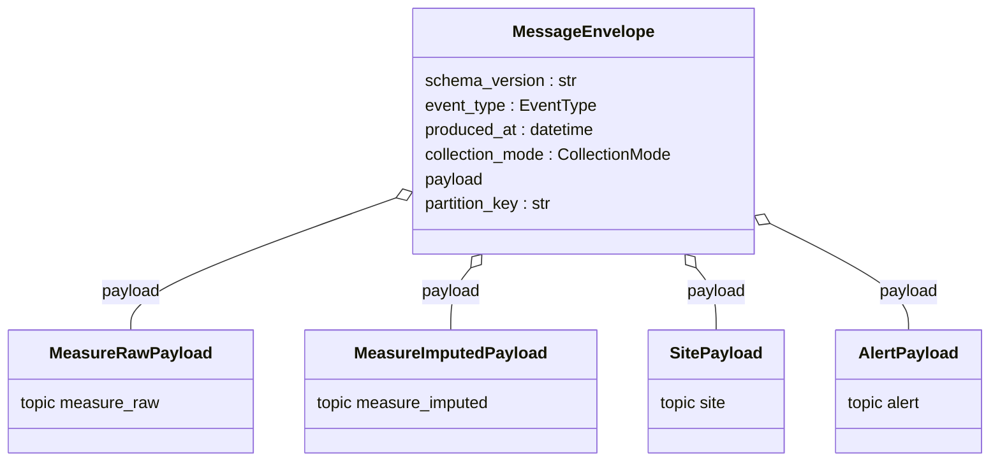

# Le modèle de données : ce qui circule dans le pipeline

Ce document décrit les objets manipulés par le pipeline, définis dans le package
`src/enervision_contracts/`. Ce package est le **vocabulaire commun** aux deux bouts de
la chaîne : le collecteur les produit, les consumers les relisent. Il ne dépend que de
Pydantic (la bibliothèque qui définit et valide la forme des objets), et cette isolation
est vérifiée par un test automatique (`tests/contracts/test_isolation.py`) : un consumer
peut ainsi importer les contrats sans avoir besoin d'installer le client HTTP ou le
client Kafka du collecteur.

## Le principe directeur du projet

> **On ne détruit jamais une valeur nulle.**

C'est la règle la plus importante à comprendre avant de lire le code. Une réponse HTTP
200 (donc *réussie*) de l'API qui contient des valeurs `null` n'est **pas une erreur** :
c'est une donnée valide qui dit "ce capteur était en panne à cet instant". Cette
information a de la valeur : elle sert plus tard à auditer la fiabilité du parc de
capteurs. Si le pipeline remplaçait discrètement ces `null` par des zéros, ou les
filtrait, cette information serait perdue pour toujours.

Concrètement, cette règle se traduit par deux décisions de conception :

1. **Tous les champs de mesure sont optionnels** dans les modèles de données (voir plus
   bas), et une mesure incomplète est publiée telle quelle, avec son niveau de qualité
   (`data_quality`) et la liste de ses causes de nullité (`null_reasons`).
2. **La reconstruction des valeurs manquantes (l'imputation) vit dans un flux séparé**,
   distinct de la donnée brute, et déclare explicitement la méthode utilisée. La donnée
   brute originale n'est donc jamais perdue ni modifiée ; on lui adjoint, à côté, une
   estimation.

*La donnée brute et son estimation ne sont jamais fusionnées : elles vivent côte à
côte, dans deux tables différentes, reliées par `(site_id, timestamp)`.*

## Les objets de "domaine" (`enervision_contracts`)

Ce sont les objets tels qu'on les manipule *dans le code métier*, avant qu'ils ne soient
mis en forme pour circuler sur Kafka.

### `Site` (`site.py`)

Décrit un bâtiment du parc, tel que renvoyé par `GET /api/v1/sites`.

| Champ | Rôle |
|---|---|
| `site_id` | Identifiant unique du site. |
| `site_type` | `office`, `factory`, `datacenter`, `retail` ou `hospital`. Sert notamment à choisir la stratégie d'imputation (voir plus bas). |
| `site_name`, `location` | Informations descriptives. |
| `capacity_kw` | Puissance maximale installée, en kilowatts (doit être strictement positive). |
| `status` | Statut du site. |

Un `Site` décrit un **état courant**, pas un événement daté : contrairement aux
mesures, on ne le modifie jamais une fois publié, on le *remplace* (voir le topic
compacté dans [02-architecture.md](02-architecture.md)).

### `EnergyReading` (`energy_reading.py`)

Un relevé brut d'un site à un instant donné. C'est l'objet central du projet.

| Champ | Rôle |
|---|---|
| `timestamp` | Horodatage du relevé, tel que renvoyé par l'API (peut être "naïf", c'est-à-dire sans fuseau horaire précisé — voir la section *"normalization.py"* de [04-collecteur.md](04-collecteur.md)). |
| `site_id` | Site concerné. |
| `consumption_kw`, `consumption_kwh`, `voltage_v`, `current_a`, `power_factor`, `temperature_celsius`, `humidity_percent` | Les sept mesures physiques possibles. **Toutes optionnelles** : `None` signifie "capteur muet à cet instant", pas "zéro". |
| `null_reasons` | Liste de chaînes expliquant pourquoi certains champs sont vides (par exemple `"sensor_offline"`). |
| `data_quality` | Niveau de qualité global du relevé : `good`, `partial`, `degraded` ou `critical` (liste non fermée : une valeur inédite est tolérée, pas rejetée). |

Deux détails de conception valent d'être notés :

- Le modèle accepte des champs inconnus (`extra="allow"`) : si une future version de
  l'API ajoute un champ, il est conservé tel quel plutôt que rejeté ou silencieusement
  perdu — toujours la même règle de non-destruction.
- Le modèle est **immuable** (`frozen=True`) : une mesure brute est un fait historique,
  aucun code en aval ne doit pouvoir le réécrire par erreur.

### `ImputedReading` (`imputed_reading.py`)

Une mesure **reconstruite**, publiée dans un flux séparé de la mesure brute (voir
la section *"imputation.py"* de [04-collecteur.md](04-collecteur.md) pour
le détail de l'algorithme).

| Champ | Rôle |
|---|---|
| `site_id`, `timestamp` | Identifient la mesure d'origine ; la corrélation avec `EnergyReading` se fait par cette paire, pas par un identifiant technique. |
| Les sept champs de mesure | Comme `EnergyReading`, mais certaines valeurs qui étaient `None` peuvent maintenant porter une estimation. |
| `imputation_method` | La stratégie utilisée : `linear_interpolation` (interpolation linéaire), `forward_fill` (recopie de la dernière valeur connue), `moving_average` (moyenne mobile, non utilisée actuellement), `excluded`, ou `none` si rien n'a été reconstruit. |
| `imputed_fields` | La liste des champs *effectivement* reconstruits sur cette ligne précise — utile pour la supervision. |

### `Alert` (`alert.py`)

Une alerte de consommation active, telle que renvoyée par `GET /api/v1/alerts`.

| Champ | Rôle |
|---|---|
| `alert_id` | Identifiant attribué par l'API. **Attention** : l'instance mock fabrique une liste d'alertes neuve à chaque appel, cet identifiant n'a donc de sens qu'au sein d'un message (voir l'encadré ci-dessous). |
| `timestamp`, `site_id` | Quand et où. |
| `severity` | `low`, `medium`, `high` ou `critical`. |
| `type` | `spike`, `threshold`, `anomaly`, `outage` ou `sensor`. |
| `message` | Description lisible. |
| `value`, `threshold` | La valeur mesurée et le seuil dépassé, en kW. |

> **Ce que le simulateur d'alertes impose de savoir.** L'API mock ne renvoie jamais une
> liste stable d'alertes "actives" : elle en régénère une nouvelle liste à chaque appel.
> Deux interrogations espacées de vingt secondes n'ont donc aucune alerte en commun.
> Conséquence pratique : la table `alert` en base accumule autant de lignes que le
> collecteur relève d'alertes au fil du temps (quelques milliers par jour à la cadence
> par défaut), et non un petit nombre d'alertes "en cours". Ce n'est pas un défaut du
> pipeline, mais une propriété du simulateur — une vraie API d'alertes renverrait un état
> courant stable et ce comportement serait différent.

## L'enveloppe des messages (`envelope.py`)

Les objets ci-dessus sont ceux du code métier. Avant de les publier sur Kafka, le
collecteur les emballe dans une **enveloppe** (`MessageEnvelope`) qui ajoute des
métadonnées communes à tous les messages, quelle que soit leur nature :

`schema_version` est la version du contrat (`"1.0.0"`), à incrémenter si le format
change de façon non rétrocompatible. `produced_at` est l'instant où le message a été
produit, distinct de l'instant de la mesure elle-même. `collection_mode` (`realtime` ou
`batch`) est absent sur les fiches de site, qui ne sont pas liées à un cycle de collecte
précis. Le `payload` est l'un des quatre types ci-dessus, chacun réservé à un topic.

Ces payloads ressemblent beaucoup aux objets de domaine décrits plus haut, mais avec
quelques différences déjà tournées vers la base de données de destination :

- Les payloads épousent **strictement les colonnes de la table cible** — c'est une
  règle du contrat : seules les évolutions additives (ajouter un champ) sont sûres,
  toute rupture doit s'accompagner d'un changement de `schema_version`.
- Chaque `timestamp` doit obligatoirement porter un fuseau horaire (UTC) : un champ
  `payload.timestamp` naïf est **rejeté à la validation**, ce qui empêche par
  construction de publier un horodatage ambigu sur le bus.
- `AlertPayload.value` et `AlertPayload.threshold` sont renommés `value_kw` et
  `threshold_kw`, pour correspondre aux noms des colonnes de la table `alert`. Ce
  renommage a lieu une fois, ici, plutôt que d'être répété dans chaque consumer.
- `AlertPayload.source_alert_id` porte l'identifiant venu de l'API mock ; l'`alert_id`
  final (un UUID) est généré par la base de données à l'insertion et ne circule donc
  jamais sur le bus.

### La clé de partition

Chaque enveloppe expose une propriété `partition_key`, qui vaut toujours
`payload.site_id`. C'est la clé utilisée pour choisir la partition Kafka du message
(voir [01-introduction-etl.md](01-introduction-etl.md)) : elle garantit que tous les
messages d'un même site restent dans leur ordre d'émission, même si rien ne garantit
d'ordre entre deux sites différents, ni entre deux topics différents.

## Suite

- [04-collecteur.md](04-collecteur.md) — comment ces objets sont produits.
- [05-consumers.md](05-consumers.md) — comment ces objets sont relus et écrits en base.
