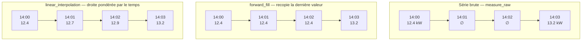
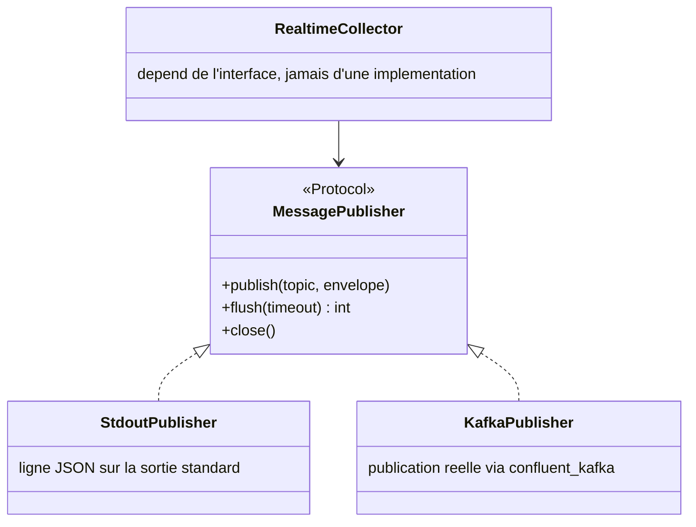
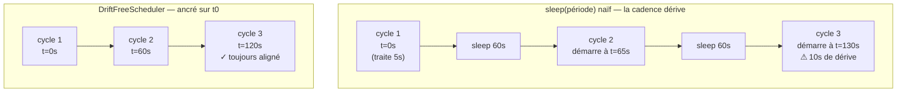
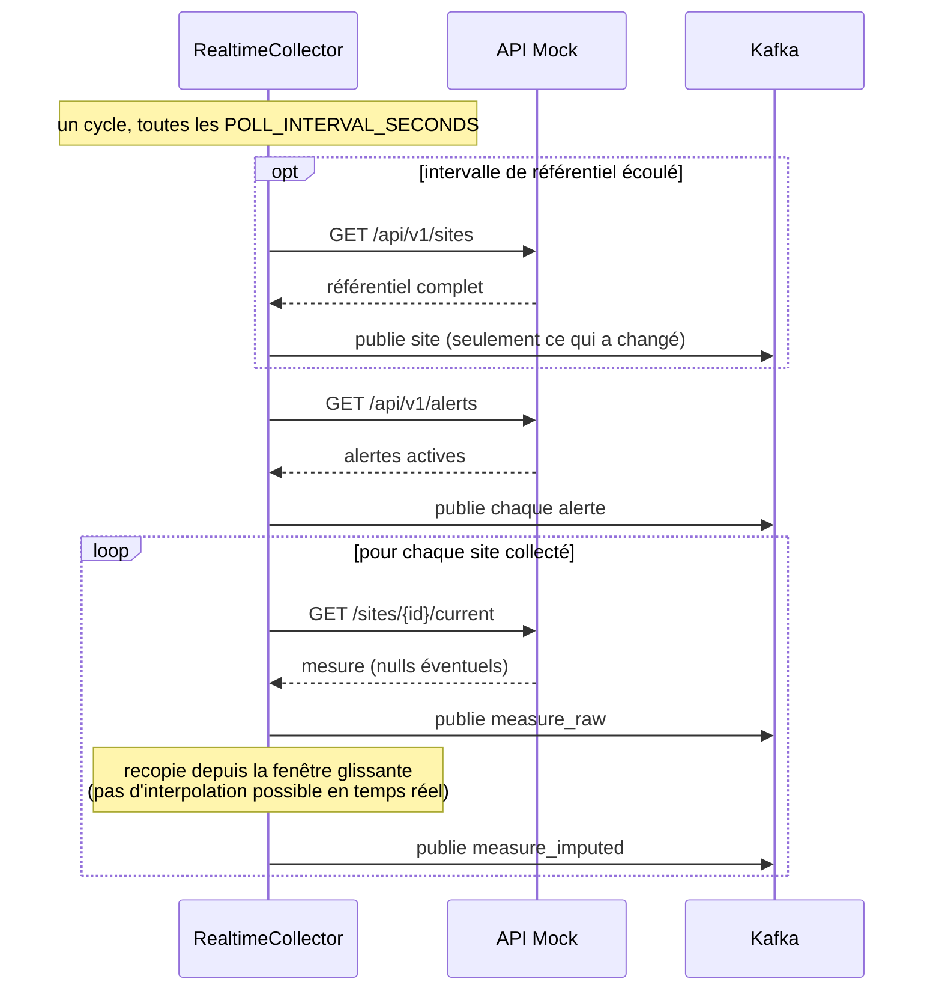
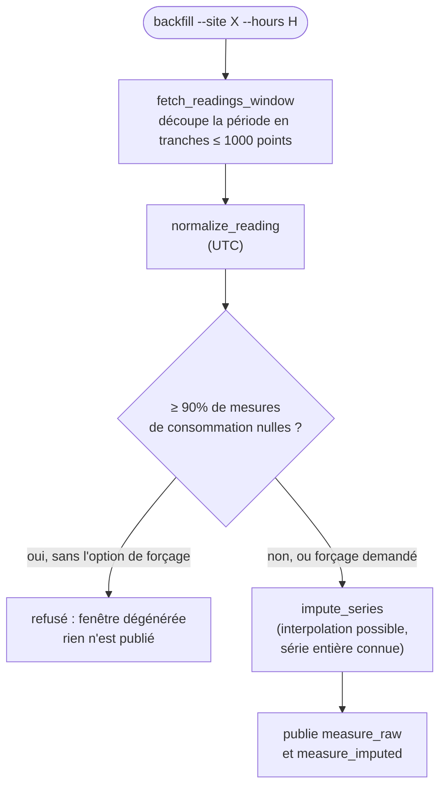

# Le collecteur (`enervision_etl`)

Le collecteur est le programme qui joue les rôles **E**xtraction, **T**ransformation et
**L**oad (Chargement) : il va chercher la donnée sur l'API mock, la nettoie, comble
prudemment certains trous, et la publie sur Kafka. Son code vit dans
`src/enervision_etl/`, organisé exactement selon ces trois étapes :

```
enervision_etl/
├── config.py            configuration validée au démarrage
├── cli.py                point d'entrée : les commandes `collect-realtime` et `backfill`
├── extract/              E : client HTTP, client de l'API, sélection des sites
├── transform/             T : normalisation des horodatages, imputation
├── load/                  L : publication vers Kafka ou stdout
└── orchestration/         assemble les trois étapes en boucles
```

## E — Extraction (`extract/`)

### `http_client.py` — un client HTTP robuste

`ResilientHttpClient` encapsule les appels HTTP vers l'API mock avec plusieurs garanties
qu'un simple appel `requests.get()` n'offre pas :

- **Une session réutilisée**, pour éviter de renégocier une connexion TCP à chaque
  mesure.
- **Un rejeu automatique**, mais seulement sur les pannes *transitoires* (codes HTTP
  500, 502, 503, 504). Un code 404 (site inconnu) ou 422 (paramètre invalide) est
  déterministe : le rejouer ne changerait jamais la réponse, ça ne ferait qu'ajouter de
  la charge inutile.
- **Un espacement minimal entre deux requêtes** (`API_MOCK_MIN_REQUEST_INTERVAL_SECONDS`).
  Ce n'est pas une politesse envers le serveur : l'instance mock **se dégrade** si on
  l'interroge en rafale, et renvoie alors des séries entièrement nulles — qu'on
  prendrait à tort pour des pannes de capteurs si on ne le savait pas. Respecter ce
  rythme protège donc autant la mesure que le serveur.
- **Une traduction des codes HTTP en exceptions métier** nommées (`SiteNotFoundError`,
  `InvalidRequestParameterError`, `MockApiUnavailableError`), pour que le code appelant
  puisse réagir différemment selon la nature du problème plutôt que d'inspecter un code
  numérique.

### `mock_api_client.py` — un client "typé" de l'API

`MockApiClient` s'appuie sur `ResilientHttpClient` pour offrir une méthode par endpoint
de l'API, chacune renvoyant directement des objets validés (`Site`, `EnergyReading`,
`Alert`) plutôt que du JSON brut :

- `fetch_site_registry()` → tout le parc (`GET /api/v1/sites`)
- `fetch_site(site_id)` → un site précis
- `fetch_current_reading(site_id)` → la mesure instantanée d'un site (`GET
  /api/v1/sites/{id}/current`), utilisée par la collecte temps réel
- `fetch_active_alerts()` → toutes les alertes actives en un seul appel, quelle que soit
  la taille du parc (contrairement aux mesures, qui demandent un appel par site)
- `fetch_readings_window(...)` → l'historique simulé d'un site sur une période, utilisé
  par le rattrapage (`backfill`)

Le point délicat de ce module est `fetch_readings_window`. L'endpoint
`/api/v1/readings` a un comportement particulier, mesuré empiriquement sur l'instance
réelle :

- Son paramètre `limit` n'est **pas** une taille de page, mais un nombre total de
  points à répartir sur toute la fenêtre demandée.
- L'API **régénère la série à chaque appel** : il est donc impossible de "paginer" en
  demandant la suite d'un appel précédent (il n'y a pas de curseur stable).
- Elle plafonne à 1000 points par appel (`MAX_READINGS_PER_REQUEST`), au-delà elle
  répond une erreur 422.

Pour contourner ces contraintes, `fetch_readings_window` découpe la période demandée en
**tranches jointives** (des sous-périodes qui se suivent sans se chevaucher), chacune
échantillonnée à la résolution voulue, et les appelle une par une (`_fetch_readings_chunk`).
Si la période est trop grande pour être couverte en un nombre raisonnable de tranches
(`MAX_CHUNKS_PER_WINDOW = 500`), la fonction refuse la demande plutôt que de rendre un
historique tronqué — car un historique tronqué, pris pour complet par le reste du
pipeline, ferait passer des mesures manquantes pour de la donnée réelle.

### `site_selection.py` — quels sites collecter

La liste des sites à collecter **vit dans l'API**, jamais dans la configuration. La
variable d'environnement `SITES` ne sert qu'à *restreindre* cette collecte (par exemple
pour un environnement de développement, ou pour répartir la charge entre plusieurs
instances du collecteur) — elle ne la définit jamais.

`resolve_site_identifiers(configured_sites, site_registry)` croise les deux : si
`configured_sites` est vide, tous les sites exposés par l'API sont retenus ; sinon,
chaque identifiant configuré doit exister dans le référentiel, sans quoi le démarrage
échoue avec la liste précise des identifiants introuvables (`UnknownConfiguredSiteError`)
— plutôt qu'un échec silencieux qui aurait laissé croire que ces sites étaient bien
collectés.

## T — Transformation (`transform/`)

### `normalization.py` — mise à l'heure UTC et taux de charge

Deux fonctions pures (sans effet de bord, elles ne font que transformer une entrée en
sortie) :

- `to_utc(timestamp, source_timezone)` : convertit un horodatage en UTC. Si
  l'horodatage porte déjà un fuseau, il est simplement reconverti. S'il est **naïf**
  (sans fuseau — l'API mock renvoie ce genre d'horodatages), il est d'abord rattaché au
  fuseau déclaré en configuration (`API_MOCK_SOURCE_TIMEZONE`), une convention externe à
  la donnée elle-même, puis converti.
- `compute_load_percent(consumption_kw, capacity_kw)` : calcule le taux de charge d'un
  site en pourcentage de sa capacité installée. Une valeur au-dessus de 100% n'est **pas
  plafonnée** : une surcharge est un événement métier réel qu'il ne faut pas masquer.
  Si `consumption_kw` est `None` (capteur muet), le résultat est `None` — jamais 0% :
  une mesure absente ne veut pas dire une consommation nulle.

`normalize_reading` et `normalize_alert` produisent une copie du relevé ou de l'alerte
d'origine avec seulement l'horodatage converti en UTC ; tout le reste (mesures, causes
de nullité, niveau de qualité) est reporté à l'identique.

### `imputation.py` — reconstruire prudemment les trous

C'est le module le plus subtil du projet. Il répond à la question : *que faire d'une
valeur manquante ?*

**Deux principes gouvernent tout le module :**

1. **Les trous sont évalués champ par champ.** Une panne du thermomètre ne justifie pas
   de recalculer la consommation, qui elle est bien mesurée. Chacun des sept champs de
   mesure (`consumption_kw`, `voltage_v`, etc.) est traité indépendamment des autres.
2. **Un trou trop long n'est pas comblé.** Au-delà d'une longueur configurée
   (`IMPUTATION_MAX_GAP_MEASURES`, en nombre de mesures consécutives manquantes),
   reconstruire une valeur deviendrait une pure invention plutôt qu'une estimation
   raisonnable — le trou reste donc tel quel, avec `imputation_method = "none"`.

**Deux stratégies de reconstruction sont implémentées :**

- **Recopie de la dernière valeur connue** (`forward_fill`) : ne regarde que le passé,
  donc utilisable même en temps réel, où la mesure *suivante* n'existe pas encore. Un
  trou en tout début de série (rien à recopier) reste tel quel.
- **Interpolation linéaire** (`linear_interpolation`) : trace une droite entre la
  mesure qui précède le trou et celle qui le suit, et pondère chaque point manquant par
  le temps réellement écoulé (pas par son simple rang dans la série, car un collecteur
  ne respecte jamais une cadence parfaitement régulière). Exige un ancrage **des deux
  côtés** du trou : un trou en tout début ou toute fin de série reste donc tel quel.



*Le même trou (14:01 et 14:02 manquants), comblé par les deux stratégies. La recopie
"plaque" la dernière valeur connue ; l'interpolation trace une progression entre les
deux valeurs qui encadrent le trou.*

**Quelle stratégie pour quel site ?** `IMPUTATION_METHOD_BY_SITE_TYPE` associe un type
de site à une stratégie par défaut :

| Type de site | Stratégie | Intuition |
|---|---|---|
| `datacenter`, `hospital` | `forward_fill` | Consommation réputée stable : recopier la dernière valeur connue est jugé raisonnable. |
| `office`, `factory`, `retail` | `linear_interpolation` | Consommation plus variable : une droite entre deux points connus est jugée plus fidèle. |

Cette table est explicitement documentée dans le code comme une **hypothèse de travail**
de l'équipe, non confirmée par la mesure (le simulateur ne produit pas assez de vrais
trous exploitables pour trancher). Elle reste modifiable, et peut être surchargée site
par site via un paramètre `overrides`, sans toucher au code. Le script
`scripts/compare_imputation_strategies.py` sert justement à comparer les stratégies sur
l'ensemble du parc, pour, à terme, confirmer ou infirmer cette hypothèse.

**Une contrainte s'impose malgré tout, indépendamment de cette table :** en collecte
temps réel, la mesure suivante n'est jamais connue au moment où la mesure courante est
traitée. Seule la recopie (`forward_fill`) est donc applicable à ce moment-là — même si
la table ci-dessus recommanderait l'interpolation pour ce type de site. C'est le rôle du
paramètre `lookahead_available` de `impute_series` : à `False`, il replie
automatiquement toute demande d'interpolation vers la recopie. En rattrapage historique
en revanche, la série entière est connue d'avance : l'interpolation devient alors
possible et pertinente.

## L — Chargement (`load/`)

### `publisher.py` — une interface, pas un client concret

Le collecteur ne dépend jamais directement d'un client Kafka : il dépend d'un
**protocole** (`MessagePublisher`), une interface définissant trois méthodes
(`publish`, `flush`, `close`). Deux implémentations existent :

- **`StdoutPublisher`** (`stdout_publisher.py`) : écrit chaque message comme une ligne
  JSON autonome sur la sortie standard. Elle sert à dérouler toute la chaîne sans avoir
  besoin d'un broker Kafka — utile en développement, ou pour produire un jeu d'essai
  réaliste que les consumers peuvent ensuite rejouer (voir
  [07-utilisation.md](07-utilisation.md)).
- **`KafkaPublisher`** (`kafka_publisher.py`) : publie réellement sur Kafka, via la
  bibliothèque `confluent_kafka`.

Ce découpage permet de tester et de démontrer toute la chaîne sans jamais avoir besoin
d'un vrai broker.



### `kafka_publisher.py` — les pièges du client Kafka

Ce module documente et gère trois comportements du client `confluent_kafka` qui, ignorés,
perdraient des messages en silence :

1. **La publication est asynchrone.** Appeler `produce()` met le message dans une file
   locale, mais ne garantit pas qu'il soit parti sur le réseau. Les callbacks de
   confirmation de livraison ne s'exécutent que lorsqu'on appelle `poll()` ou `flush()`.
2. **La file locale est finie.** Si elle est pleine, `produce()` lève une `BufferError`.
   `KafkaPublisher.publish` réagit à cette erreur en servant les livraisons en attente
   (`poll`) pour vider un peu la file, puis retente une fois avant de renoncer
   bruyamment (`MessagePublicationError`) — échouer visiblement vaut mieux que perdre un
   message en silence.
3. **Ce qui reste en file à l'arrêt du processus est perdu.** D'où l'importance de
   toujours appeler `flush()` avant de couper le programme — voir plus bas la section
   sur l'arrêt propre.

Le producer est configuré en **idempotence** (`enable.idempotence: True`, `acks: all`) :
si un rejeu réseau interne au client provoque un doublon d'envoi, Kafka garantit malgré
tout que le message n'apparaît qu'une seule fois sur le topic.

### `site_registry_publisher.py` — ne publier que ce qui change

Le référentiel des sites est un état courant, pas un flux d'événements : quelques
dizaines de sites qui changent au mieux une ou deux fois par an. Republier
l'intégralité de la liste à chaque cycle serait un gaspillage. Deux mécanismes s'en
protègent :

- **Côté broker** : la compaction du topic ne conserve que le dernier message par site
  (voir [02-architecture.md](02-architecture.md)) — une propriété du topic, appliquée à
  sa création côté infrastructure.
- **Côté collecteur** : `SiteRegistryPublisher` garde en mémoire la dernière version
  publiée de chaque site, et ne republie que les sites nouveaux ou dont les
  caractéristiques ont réellement changé (`publish_changes`). En régime stable, le topic
  ne reçoit donc rien à chaque cycle.

Un site qui disparaît de l'API n'est pas "annulé" (le contrat ne prévoit pas de message
à valeur nulle pour ça) : le cas réel — une mise hors service — se traduit par un
changement de `status`, qui lui est bien détecté et republié.

## Orchestration (`orchestration/`) — assembler E, T et L en boucles

### `drift_free_scheduler.py` — un ordonnanceur sans dérive

Pourquoi ne pas simplement faire `time.sleep(POLL_INTERVAL_SECONDS)` entre deux cycles
de collecte ? Parce qu'un `sleep` naïf attend *après* le traitement : la durée réelle
d'un cycle devient alors "la période + la durée du traitement", et cet écart
s'accumule cycle après cycle — la cadence dérive lentement.

`DriftFreeScheduler` calcule au contraire chaque instant de déclenchement depuis une
**ancre fixe** (l'instant du tout premier cycle), jamais depuis l'instant courant :
`prochain_declenchement = ancre + index * periode`. La cadence reste ainsi alignée
indéfiniment. Si un cycle a débordé d'une ou plusieurs périodes, les déclenchements
manqués sont **abandonnés plutôt qu'empilés** — sans quoi la boucle tournerait en
continu pour "rattraper" un retard déjà pris, sans jamais s'arrêter.

L'attente est en plus fractionnée en petites tranches (0,25 seconde), pour pouvoir
réagir rapidement à une demande d'arrêt (voir ci-dessous) plutôt que de rester bloquée
jusqu'à la fin de la période en cours.



*Avec un `sleep` naïf, le temps de traitement de chaque cycle s'ajoute à la période et
la cadence s'écarte peu à peu de la cible. Avec un ancrage fixe, chaque déclenchement
est recalculé depuis l'origine, la cadence reste alignée indéfiniment.*

### `graceful_shutdown.py` — s'arrêter proprement

Docker envoie un signal `SIGTERM` pour demander l'arrêt d'un conteneur, puis, après un
délai de grâce, un `SIGKILL` si le processus n'a pas terminé. Le problème : Python
interrompt un processus sur `SIGTERM` **sans exécuter les blocs `finally`** — la file du
producer Kafka ne serait donc jamais vidée, et les messages encore en attente seraient
perdus à chaque redémarrage du conteneur.

`ShutdownRequest` résout ça en transformant le signal en un simple **drapeau** consulté
par la boucle entre deux cycles. Le signal ne coupe donc rien directement : il demande
juste "arrête-toi au prochain moment sûr". Le cycle en cours va toujours à son terme —
ce qui évite de publier une "photo" partielle du parc — puis la boucle sort normalement,
laissant les blocs `finally` (et donc le `flush()` du producer) s'exécuter.

### `realtime_collector.py` — la boucle de collecte temps réel



`RealtimeCollector.run_cycle()` exécute, à chaque cycle :

1. **Rafraîchit le référentiel des sites**, si l'intervalle configuré
   (`SITE_REFRESH_INTERVAL_SECONDS`) est écoulé, et republie ce qui a changé.
2. **Publie les alertes actives** du parc, en un seul appel API. Une panne de cet
   endpoint est journalisée mais ne bloque pas le reste du cycle (sinon un seul service
   d'alertes indisponible priverait tout le parc de ses mesures).
3. **Pour chaque site collecté** : interroge sa mesure instantanée, la normalise
   (UTC), la publie comme mesure brute, puis reconstruit et publie sa version imputée
   à partir d'une petite fenêtre glissante des dernières mesures connues du site (pas
   plus longue que nécessaire pour couvrir `IMPUTATION_MAX_GAP_MEASURES`, afin de ne
   jamais grossir indéfiniment).

**Une panne sur un site n'interrompt jamais les autres** : chaque interrogation est
isolée dans son propre bloc `try/except`, et l'échec d'un site est simplement noté dans
le bilan du cycle (`CycleReport.failed_sites`) plutôt que d'interrompre toute la
collecte.

Le référentiel est toujours traité **avant** les alertes et les mesures dans un même
cycle : une alerte porte une clé étrangère vers son site, que le consumer doit pouvoir
résoudre. Publier le référentiel en premier réduit (sans l'éliminer complètement, car
les topics ne sont pas ordonnés entre eux côté Kafka) le risque que les consumers
rencontrent un site encore inconnu.

`cadence_shortfall_seconds` est un garde-fou qui compare, une fois le premier cycle
passé et le parc connu, la période de collecte visée au temps qu'il faudrait
*mécaniquement* pour interroger tous les sites en respectant l'espacement minimal entre
requêtes. Si la cadence demandée est intenable, un avertissement explicite est
journalisé au démarrage — plutôt que de laisser l'exploitant découvrir, des semaines
plus tard, des cycles silencieusement sautés.

### `batch_backfill.py` — le rattrapage historique



`BatchBackfill.run(site_id, start_time, end_time, resolution_seconds)` rejoue une
période passée d'**un seul site**. Deux différences importantes avec la collecte temps
réel :

- **La série entière étant connue d'avance**, l'interpolation linéaire devient possible
  (contrairement au temps réel, contraint à la recopie — voir plus haut).
- **Une fenêtre intégralement nulle est refusée par défaut.** Ce n'est pas un vrai
  historique : c'est l'état d'une panne *au moment de l'appel*, que le simulateur
  projette artificiellement sur toute la période demandée. La publier telle quelle
  reviendrait à inventer des heures entières de coupure qui n'ont peut-être jamais eu
  lieu. Le seuil est fixé à 90% de valeurs de consommation manquantes
  (`DEGENERATE_NULL_RATIO`). L'option `--force-degenerate` de la CLI permet de passer
  outre ce garde-fou si on le souhaite malgré tout.

Contrairement à la collecte temps réel, une panne de l'API pendant un rattrapage n'est
**pas** absorbée silencieusement : elle remonte et interrompt la commande
(`raise typer.Exit(code=1)` côté CLI). Un rattrapage vise un site précis et un résultat
précis ; échouer bruyamment est préférable à un silence qui laisserait croire que le
rattrapage a réussi.

## Le point d'entrée : `cli.py`

Le collecteur expose deux commandes, via la bibliothèque [Typer](https://typer.tiangolo.com/) :

- `enervision-etl collect-realtime [--cycles N]`
- `enervision-etl backfill --site SITE_ID [--hours H] [--points N] [--resolution S] [--force-degenerate]`

Les deux commandes commencent par charger et valider la configuration
(`load_settings()`, voir [06-configuration.md](06-configuration.md)) — une configuration
incomplète ou invalide fait échouer le démarrage **immédiatement**, avec un message
explicite, plutôt qu'au bout de plusieurs minutes de fonctionnement dégradé.

La destination des messages (`stdout` ou `kafka`) est choisie via `PUBLISHER_TARGET` et
construite par `_build_publisher`, sans jamais être codée en dur dans la logique
métier.

Voir [07-utilisation.md](07-utilisation.md) pour des exemples concrets d'utilisation de
ces commandes.

## Suite

- [05-consumers.md](05-consumers.md) — comment les messages produits ici sont relus et
  écrits en base de données.
