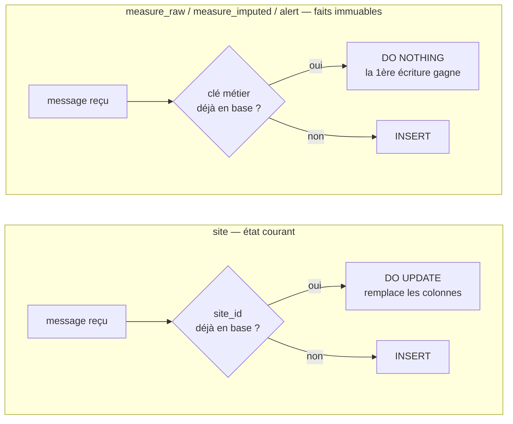
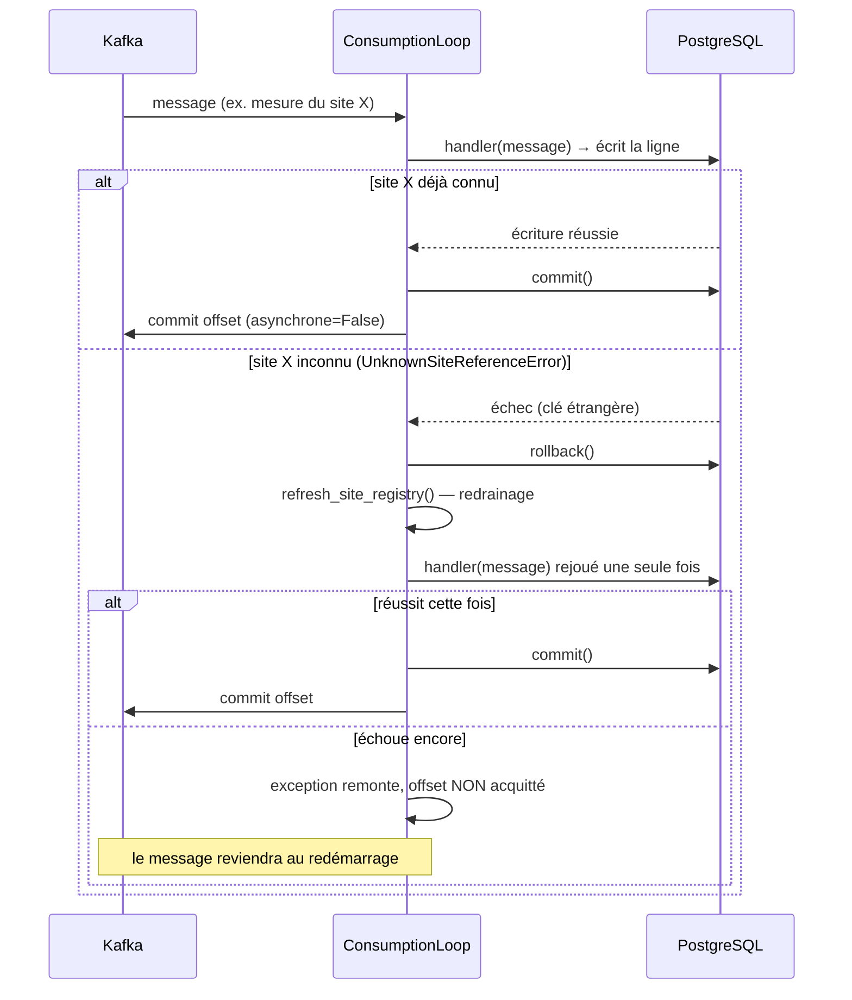
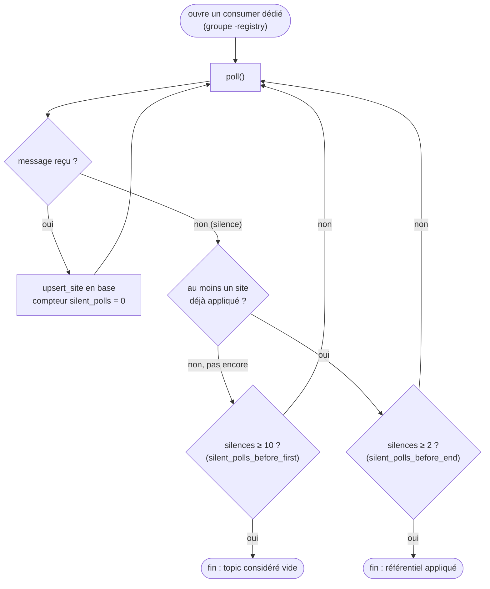

# Les consumers (`enervision_consumer`)

Les consumers sont les programmes qui relisent les messages publiés sur Kafka par le
collecteur et les écrivent dans PostgreSQL / TimescaleDB. Il y en a **deux**,
partageant la même image Docker et une bonne partie de leur code, mais tournant en tant
que services indépendants : le consumer de **persistance** (sites + mesures) et le
consumer d'**alerting** (alertes). Le code vit dans `src/enervision_consumer/`,
organisé ainsi :

```
enervision_consumer/
├── config.py             configuration validée au démarrage
├── cli.py                point d'entrée : `consume-persistence` et `consume-alerting`
├── extract/               lecture du bus et décodage des enveloppes
├── load/                   dépôts d'écriture, un par table du modèle
└── orchestration/          la boucle commune aux deux consumers
```

## Extraction (`extract/`)

### `kafka_consumer.py` — deux pièges du client Kafka côté lecture

Comme pour la publication (voir [04-collecteur.md](04-collecteur.md)), deux
comportements du client `confluent_kafka` sont documentés et neutralisés ici, car les
laisser par défaut perdrait des messages en silence :

1. **L'acquittement automatique est désactivé** (`enable.auto.commit: False`).
   Par défaut, le client Kafka avance la position de lecture (l'*offset*) tout seul, à
   intervalle régulier — **sans savoir** si l'écriture en base de données a réellement
   réussi. Si on laissait ce comportement par défaut, un message pourrait être marqué
   comme "lu" alors que son écriture en base a échoué : il serait perdu sans que
   personne ne le sache. C'est pourquoi l'acquittement est fait *manuellement*, et
   seulement une fois l'écriture confirmée (voir plus bas la boucle de consommation).
2. **Un groupe qui démarre reprend au début du topic** (`auto.offset.reset: earliest`),
   pas à la fin. Par défaut, un nouveau consumer group ignorerait tout ce qui a été
   publié avant sa première connexion — inacceptable ici, où il faut au contraire
   rattraper tout l'historique déjà présent sur le bus.

### `envelope_decoding.py` — relire un message selon son contrat

`decode_envelope(topic, raw_value, envelope_type)` relit le contenu JSON brut d'un
message et le valide contre le type d'enveloppe attendu pour ce topic (par exemple
`MessageEnvelope[MeasureRawPayload]` pour le topic des mesures brutes). Le type du
payload se déduit directement du topic : chaque topic ne transporte qu'une seule sorte
de message, exactement comme convenu dans
[03-modele-de-donnees.md](03-modele-de-donnees.md).

Un message illisible (JSON invalide, ou qui ne respecte pas le contrat attendu) est
**toujours signalé** par une exception (`EnvelopeDecodingError`), jamais ignoré
silencieusement : le service en aval n'a aucun moyen de deviner ce qu'il n'a pas reçu.

## Chargement (`load/`) — les dépôts d'écriture

Un module par table du modèle de données, chacun réduit à l'essentiel : construire la
requête SQL et l'exécuter. Ils partagent tous le même schéma de conception.

### `postgres_connection.py`

La connexion à PostgreSQL est ouverte en **validation manuelle**
(`autocommit=False`) — c'est-à-dire que rien n'est définitivement écrit tant que
`commit()` n'a pas été appelé explicitement. Ce n'est pas un détail technique
secondaire mais une règle du projet : le moment exact où la transaction est validée
appartient à l'**orchestration**, pas à chaque dépôt individuellement, précisément parce
que ce moment doit toujours précéder l'acquittement de l'offset Kafka (voir plus bas).

### `site_repository.py` — la seule table qu'on met à jour plutôt qu'on préserve

`upsert_site` écrit ou **remplace** un site existant (`INSERT ... ON CONFLICT (site_id)
DO UPDATE`). C'est la seule des quatre tables à fonctionner ainsi : le référentiel
décrit un état courant, pas un fait daté. Un site qui change de statut *doit* se
refléter en base — là où une mesure rejouée ne doit, elle, jamais écraser la première
écriture (voir ci-dessous).



### `measure_raw_repository.py`, `measure_imputed_repository.py`, `alert_repository.py`

Ces trois dépôts écrivent des **faits historiques**, immuables une fois enregistrés.
Leur insertion suit toujours le même schéma :
`INSERT ... ON CONFLICT (...) DO NOTHING`. Concrètement : si la ligne existe déjà, rien
ne se passe — **jamais** de `DO UPDATE`. C'est ce qui rend l'écriture **idempotente** :
recevoir deux fois le même message (par exemple parce qu'un consumer a planté juste
après avoir écrit en base mais avant d'acquitter son offset, et rejoue donc ce message
au redémarrage) ne produit aucun doublon ni aucune altération de la première écriture.

- `measure_raw_repository` identifie une mesure par sa clé métier `(site_id,
  timestamp)`. L'identifiant technique (`measure_raw_id`, un UUID) est laissé à la
  charge de la base de données.
- `measure_imputed_repository` fait la même chose, mais doit en plus **retrouver**
  l'identifiant de la mesure brute correspondante (`find_raw_id`), pour relier les deux
  lignes. Comme un `INSERT ... ON CONFLICT DO NOTHING` ne renvoie rien quand il absorbe
  un doublon, cette recherche se fait par une requête séparée plutôt que via un
  `RETURNING` au moment d'écrire la mesure brute. Si la mesure brute n'est pas encore
  arrivée (les deux topics ne sont pas garantis d'être en ordre entre eux), la mesure
  imputée est tout de même écrite, mais avec un lien vide (`measure_raw_id = NULL`,
  autorisé par le schéma) — attendre créerait un interblocage, puisque la mesure brute
  ne peut arriver que par la même boucle qu'on bloquerait en l'attendant.
- `alert_repository` identifie une alerte par `source_alert_id` (celui attribué par
  l'API mock), pas par un identifiant technique — c'est ce qui absorbe la remise
  multiple d'un même message par Kafka. Attention : comme expliqué dans
  [03-modele-de-donnees.md](03-modele-de-donnees.md), l'API mock ne réutilise jamais un
  `alert_id`, donc cette idempotence protège contre les doublons de *transport* (Kafka),
  pas contre les doublons *métier* de la source elle-même.

### `errors.py`

Deux exceptions structurent la gestion des échecs d'écriture :

- `PersistenceError` : une écriture a échoué pour une raison quelconque. Le principe
  associé : **l'offset Kafka du message concerné ne doit jamais être acquitté** dans ce
  cas, pour que le message soit rejoué plutôt que silencieusement perdu.
- `UnknownSiteReferenceError` (qui hérite de `PersistenceError`) : un fait référence un
  site qui n'est pas encore dans le référentiel local. Ce n'est **pas** une donnée
  invalide, mais une simple course entre deux topics non ordonnés — la fiche du site
  est peut-être encore en route. C'est cette exception précise que l'orchestration
  détecte pour déclencher un nouveau drainage du référentiel (voir plus bas).

## Orchestration (`orchestration/`) — la boucle commune

### `consumption_loop.py` — les trois règles centrales

`ConsumptionLoop` porte les règles qui **ne doivent exister qu'à un seul endroit**,
partagées par les deux consumers plutôt que dupliquées (ce qui les aurait fait
diverger avec le temps). Pour chaque message lu :

1. **Le référentiel est drainé avant toute chose**, au tout début de `run()` — avant
   même de s'abonner aux topics métier — puisque les topics ne sont pas ordonnés entre
   eux et que `site_id` est une clé étrangère.
2. **L'écriture en base est validée (`commit`) avant que l'offset Kafka ne soit
   acquitté**, et jamais l'inverse. Si l'ordre était inversé et qu'une coupure survenait
   entre les deux, un message pourrait être marqué comme "lu" sans que son écriture en
   base ait réellement abouti — perdu, sans que rien ne le signale.
3. **Un fait dont le site est encore inconnu déclenche un redrainage puis une nouvelle
   tentative.** Concrètement (`_persist`) : si `handler(message)` lève une
   `UnknownSiteReferenceError`, la transaction en cours est annulée
   (`connection.rollback()`), le référentiel est redrainé, puis le même message est
   rejoué **une seule fois**. S'il échoue encore, l'exception remonte sans que l'offset
   soit acquitté : le message reviendra automatiquement au redémarrage du service.

Le client Kafka rend aussi, par le même `poll()` que les vrais messages, des
**événements d'erreur du broker** (par exemple, un topic pas encore connu). Seule la
méthode `error()` du message permet de les distinguer d'un vrai message : la boucle les
journalise et les ignore, sans quoi le décodage de l'enveloppe échouerait sur ce qui
n'est en réalité qu'un avertissement transitoire.



*C'est cette séquence, appliquée à chaque message, qui garantit qu'aucune écriture
n'est jamais marquée "lue" côté Kafka avant d'être réellement actée en base.*

### `site_registry_drain.py` — reconstruire le référentiel local

`SiteRegistryDrain` relit **l'intégralité** du topic compacté des sites, depuis son
début, et applique chaque fiche en base (`upsert_site`). Comme le topic est compacté
(voir [02-architecture.md](02-architecture.md)), le relire depuis le début donne bien
l'état *courant* du parc, pas un historique complet des changements passés.

Deux détails techniques méritent d'être notés :

- **Ce drainage n'acquitte jamais ses offsets**, volontairement : il tourne sur un
  consumer group dédié (le groupe du service suffixé par `-registry`) et doit reprendre
  au début à *chaque* appel, plutôt que de continuer depuis sa dernière position.
- **Détecter la fin du topic est délicat**, faute d'API d'offsets dans l'interface
  minimale utilisée ici : elle se déduit du silence (plusieurs lectures consécutives
  sans message). Mais il faut distinguer deux silences différents : un groupe qui vient
  tout juste de rejoindre le topic ne reçoit rien tant que sa partition ne lui a pas
  encore été attribuée par Kafka — ce qui n'a rien à voir avec une fin de topic. Le
  drainage tolère donc beaucoup plus de lectures vides *avant* le tout premier message
  (`silent_polls_before_first`, 10 par défaut) qu'*après* (`silent_polls_before_end`, 2
  par défaut).

Si le drainage s'arrêtait malgré tout trop tôt (avant d'avoir vu tous les sites), ce
n'est pas grave en pratique : le fait qui référence un site manquant échouerait alors
sur la contrainte de clé étrangère en base, ce qui déclenche justement — via
`UnknownSiteReferenceError` — un nouveau drainage.



*Le seuil de tolérance est plus large avant le premier message reçu (le temps que
Kafka attribue sa partition au groupe) qu'après (où un silence signale vraiment la fin
du topic).*

### `persistence_consumer.py` — le service qui écrit sites et mesures

`PersistenceConsumer` consomme trois topics (`site`, `measure_raw`, `measure_imputed`)
et associe à chacun une méthode d'écriture (`_apply_site`, `_apply_raw_measure`,
`_apply_imputed_measure`), déléguées ensuite à `ConsumptionLoop` pour l'exécution
proprement dite. Il produit un bilan (`ConsumptionReport`) qui compte notamment les
`unlinked_imputed_measures` : les mesures imputées écrites sans avoir pu être reliées à
leur mesure brute d'origine, un compteur utile pour surveiller que ce trou reste
occasionnel.

### `alerting_consumer.py` — le service qui écrit les alertes

`AlertingConsumer` fonctionne exactement sur le même principe, mais pour deux topics
seulement (`site`, `alert`). Il partage la même `ConsumptionLoop` que le consumer de
persistance — donc les mêmes trois règles décrites plus haut — mais tourne sur son
**propre** consumer group et sa propre connexion à la base, entièrement indépendant du
consumer de persistance.

### `graceful_shutdown.py`

Identique en principe à celui du collecteur (voir
la section *"graceful_shutdown.py"* de [04-collecteur.md](04-collecteur.md)) : un
signal `SIGTERM`/`SIGINT` lève un simple drapeau, consulté par la boucle entre deux
messages, plutôt que d'interrompre brutalement un traitement en cours.

## Le point d'entrée : `cli.py`

Deux commandes, une par service, qui ne diffèrent que par les topics consommés et le
consumer group utilisé — la même image Docker sert aux deux, seule la commande passée
change :

- `enervision-consumer consume-persistence [--max-messages N]`
- `enervision-consumer consume-alerting [--max-messages N]`

`--max-messages` borne le nombre de messages traités avant de s'arrêter — pratique pour
un essai ponctuel plutôt que de laisser tourner le service indéfiniment.

## Suite

- [06-configuration.md](06-configuration.md) — le détail de chaque variable
  d'environnement.
- [07-utilisation.md](07-utilisation.md) — des exemples concrets de lancement, y compris
  bout en bout (collecteur → fichier → consumers) sans broker Kafka.
