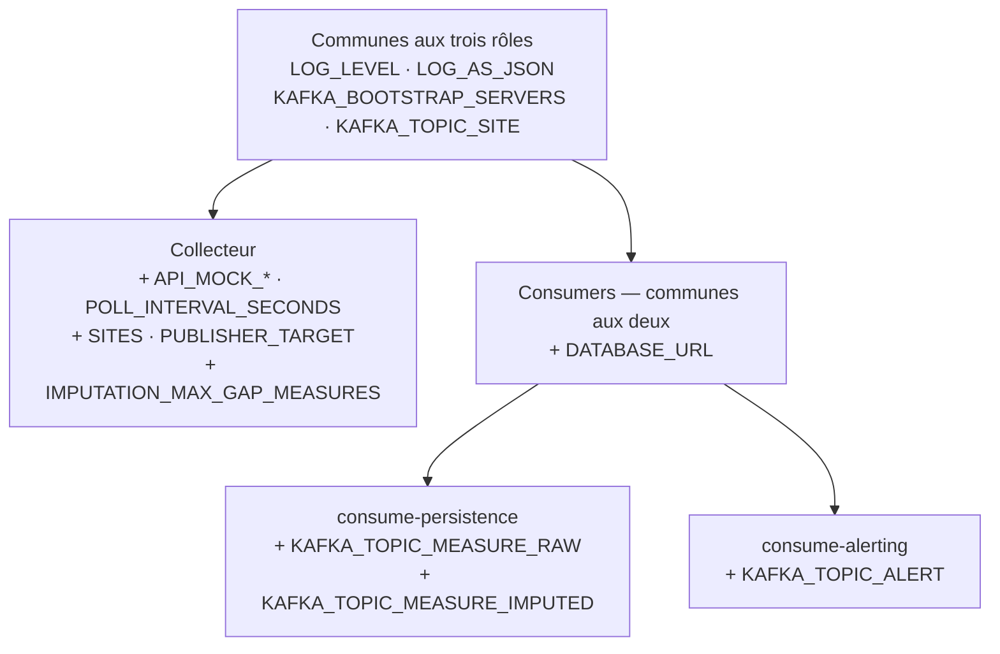

# Configuration

Toute la configuration du projet passe par des **variables d'environnement**, jamais
par des adresses codées en dur dans le code source. C'est une règle explicite du
projet : elle permet de faire tourner exactement le même code en développement, en test
et en production, en ne changeant que l'environnement.

## Comment ça marche techniquement

Le collecteur (`enervision_etl/config.py`) et les consumers
(`enervision_consumer/config.py`) définissent chacun une classe de configuration basée
sur `pydantic_settings.BaseSettings`. Cette bibliothèque lit automatiquement :

1. Les variables déjà présentes dans l'environnement du processus.
2. À défaut, un fichier `.env` à la racine du dépôt (non versionné — chacun a le sien).

Chaque champ correspond à une variable d'environnement de même nom, en majuscules
(`api_mock_base_url` ↔ `API_MOCK_BASE_URL`). Les champs qui n'ont **pas** de valeur par
défaut dans le code sont **obligatoires** : leur absence fait échouer le démarrage
immédiatement, avec un message d'erreur explicite — jamais un plantage silencieux ou
retardé après plusieurs minutes de fonctionnement dégradé.

Pour démarrer, copiez le modèle fourni et renseignez-le :

```bash
cp .env.example .env
```

## Qui lit quoi

Les trois rôles exécutables ne lisent pas les mêmes variables : le tableau ci-dessous
précise, pour chacune, qui l'utilise.



*`KAFKA_CONSUMER_GROUP` n'apparaît pas ici volontairement : chaque service a son propre
défaut et ne doit **jamais** être partagé entre les deux (voir plus bas).*

### Communes aux trois rôles

| Variable | Rôle | Défaut |
|---|---|---|
| `LOG_LEVEL` | Seuil de journalisation (`INFO`, `DEBUG`...). | `INFO` |
| `LOG_AS_JSON` | `true` pour des logs en JSON (agrégables), `false` pour un rendu lisible en console. | `true` |
| `KAFKA_BOOTSTRAP_SERVERS` | Adresse du broker Kafka. Voir la nuance ci-dessous. | *(vide)* |
| `KAFKA_TOPIC_SITE` | Topic alimentant la table `SITE`. Doit être créé avec `cleanup.policy=compact` côté infrastructure. | `enervision.site` |

`KAFKA_BOOTSTRAP_SERVERS` n'est pas obligatoire de la même façon partout : le
collecteur ne l'exige que si `PUBLISHER_TARGET=kafka` (publier sur `stdout` ne demande
aucun broker) ; les consumers, eux, l'exigent **toujours**, n'ayant aucune autre source
de messages.

### Propres au collecteur (`enervision-etl`)

| Variable | Rôle | Défaut |
|---|---|---|
| `API_MOCK_BASE_URL` | Racine de l'API mock. Doit commencer par `http://` ou `https://`. **Obligatoire.** | — |
| `API_MOCK_TIMEOUT_SECONDS` | Délai d'attente maximal appliqué à chaque requête HTTP. | `5.0` |
| `API_MOCK_SOURCE_TIMEZONE` | Fuseau IANA (ex. `UTC`, `Europe/Paris`) présumé des horodatages *naïfs* renvoyés par l'API — voir la section *"normalization.py"* de [04-collecteur.md](04-collecteur.md). | `UTC` |
| `API_MOCK_MIN_REQUEST_INTERVAL_SECONDS` | Espacement minimal entre deux requêtes HTTP consécutives. Protège contre la dégradation de l'instance mock en cas de rafale. | `0.2` |
| `POLL_INTERVAL_SECONDS` | Période visée entre deux cycles de collecte temps réel. | `60` |
| `SITE_REFRESH_INTERVAL_SECONDS` | Délai minimal entre deux relectures du référentiel des sites. | `3600` |
| `SITES` | Restriction de la collecte : vide ou `ALL` pour tout le parc exposé par l'API, sinon une liste d'identifiants séparés par des virgules (ex. `SITE001,SITE002`). | *(vide → tout le parc)* |
| `KAFKA_TOPIC_MEASURE_RAW` | Topic des mesures brutes. | `enervision.measure_raw` |
| `KAFKA_TOPIC_MEASURE_IMPUTED` | Topic des mesures reconstruites. | `enervision.measure_imputed` |
| `KAFKA_TOPIC_ALERT` | Topic des alertes actives. | `enervision.alert` |
| `PUBLISHER_TARGET` | Destination des messages : `stdout` (aucun broker requis) ou `kafka`. | `stdout` |
| `IMPUTATION_MAX_GAP_MEASURES` | Longueur maximale (en nombre de mesures consécutives manquantes) d'un trou encore comblable par imputation. | `3` |
| `METRICS_PORT` | Port d'exposition des métriques Prometheus. | `8001` |

Le collecteur refuse de démarrer si `API_MOCK_BASE_URL` est absente, ou si
`KAFKA_BOOTSTRAP_SERVERS` est absente alors que `PUBLISHER_TARGET=kafka`.

### Propres aux consumers (`enervision-consumer`)

| Variable | Rôle | Défaut |
|---|---|---|
| `DATABASE_URL` | URL de connexion à la base. Doit commencer par `postgres://` ou `postgresql://`. **Obligatoire.** | — |
| `KAFKA_CONSUMER_GROUP` | Groupe Kafka du service. **À laisser vide** dans un fichier `.env` partagé — voir l'avertissement ci-dessous. | *(propre à chaque service)* |
| `KAFKA_TOPIC_MEASURE_RAW`, `KAFKA_TOPIC_MEASURE_IMPUTED` | Topics des mesures — lus uniquement par `consume-persistence`. | `enervision.measure_raw`, `enervision.measure_imputed` |
| `KAFKA_TOPIC_ALERT` | Topic des alertes — lu uniquement par `consume-alerting`. | `enervision.alert` |

Les consumers refusent de démarrer si `DATABASE_URL` ou `KAFKA_BOOTSTRAP_SERVERS` sont
absents.

> **⚠️ Ne jamais renseigner `KAFKA_CONSUMER_GROUP` dans un fichier `.env` partagé.**
> Chacun des deux services a son propre groupe par défaut
> (`enervision-consumer-persistence` et `enervision-consumer-alerting`). Si cette
> variable était renseignée dans un `.env` commun aux deux, ils se retrouveraient dans
> le **même** groupe Kafka, ce qui les ferait se **partager** les messages du topic des
> sites au lieu de le recevoir chacun en entier — cassant l'hypothèse selon laquelle
> chaque service tient sa propre vue complète du référentiel (voir
> [05-consumers.md](05-consumers.md)). Ne la définir que par conteneur, dans un cas très
> précis : répartir la charge entre plusieurs instances d'un *même* service.

## Nommage des topics Kafka

Chaque topic porte le nom de la table qu'il alimente, préfixé par le domaine :
`enervision.measure_raw`, `enervision.measure_imputed`, `enervision.alert`,
`enervision.site`. La destination d'un message se lit donc directement dans son nom de
topic, sans documentation séparée, et les deux extrémités du dépôt partagent ainsi le
même vocabulaire que le modèle conceptuel de données (MCD) de la base. Les noms restent
configurables : ceux ci-dessus ne sont que les valeurs par défaut.

## Petits détails utiles à savoir

- Un fichier `.env` enregistré sous Windows termine chaque ligne par un retour chariot
  (`\r`), que Docker retransmet tel quel dans l'environnement du conteneur. Les deux
  classes de configuration nettoient donc systématiquement les espaces et retours
  chariot en trop autour de chaque valeur lue, avant toute validation — sans ce
  nettoyage, une valeur comme `kafka\r` échouerait la validation d'énumération avec un
  message peu compréhensible.
- La sélection des sites (`SITES`) n'est **pas sensible à la casse** : `site001` et
  `SITE001` désignent le même site lors du croisement avec le référentiel exposé par
  l'API.

## Suite

- [07-utilisation.md](07-utilisation.md) — lancer concrètement le collecteur et les
  consumers avec cette configuration.
