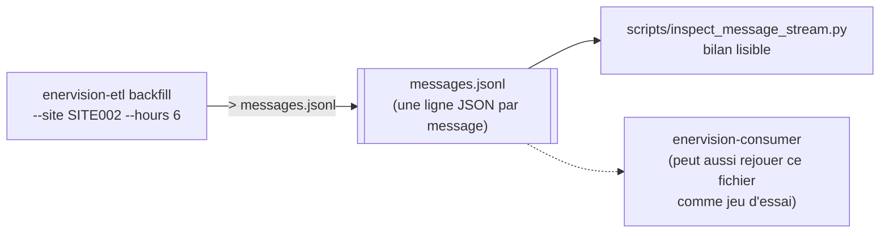
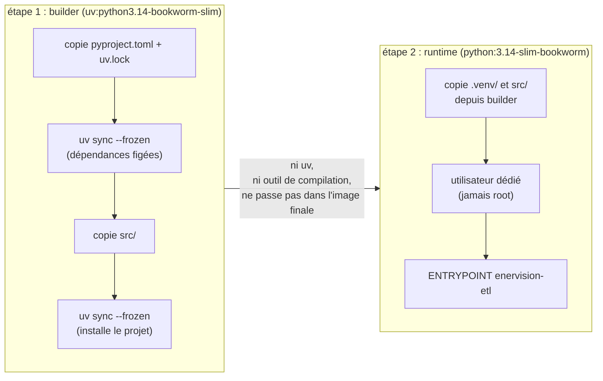

# Utilisation : installer, lancer, containeriser

## Installation

Le projet cible Python 3.14 et utilise [`uv`](https://docs.astral.sh/uv/) — un outil
qui gère à la fois l'environnement virtuel Python et le verrouillage exact des versions
de dépendances (le fichier `uv.lock`).

```bash
git clone https://github.com/enervision-g4/enervision-etl.git
cd enervision-etl
git checkout feature/skeleton

curl -LsSf https://astral.sh/uv/install.sh | sh
export PATH="$HOME/.local/bin:$PATH"

uv sync
```

`uv sync` télécharge Python 3.14 si la machine ne l'a pas déjà, crée le dossier
`.venv/`, et installe très exactement les versions figées dans `uv.lock` — pas "une
version compatible", la version exacte qui a été testée.

Ensuite, configurez le projet (voir [06-configuration.md](06-configuration.md)) :

```bash
cp .env.example .env
# puis éditer .env
```

## Lancer le collecteur

Deux commandes. La destination des messages est choisie par la variable
`PUBLISHER_TARGET` : `stdout` permet de dérouler toute la chaîne sans avoir besoin d'un
broker Kafka, `kafka` publie réellement.

### Collecte en temps réel

Interroge les sites à intervalle régulier (`POLL_INTERVAL_SECONDS`) :

```bash
uv run enervision-etl collect-realtime
uv run enervision-etl collect-realtime --cycles 3   # s'arrête après trois cycles
```

### Rattrapage historique d'un site

```bash
uv run enervision-etl backfill --site SITE002 --hours 24 --resolution 60
```

Voir la section *"batch_backfill.py"* de [04-collecteur.md](04-collecteur.md)
pour comprendre les options `--hours`, `--points`, `--resolution`, et pourquoi une
fenêtre intégralement nulle est refusée par défaut (`--force-degenerate` pour passer
outre).

### Essayer toute la chaîne sans broker Kafka

Les messages partent sur la sortie standard, les journaux (logs) sur la sortie
d'erreur — les séparer permet de rediriger uniquement le flux de messages dans un
fichier, sans y mélanger les journaux :

```bash
uv run enervision-etl backfill --site SITE002 --hours 6 > messages.jsonl
```

Ce fichier `messages.jsonl` reproduit exactement ce que Kafka aurait transporté (une
ligne JSON par message, avec son `topic`, sa clé de partition et sa valeur). Il peut
servir de jeu d'essai pour comprendre le format des messages, ou pour vérifier
visuellement ce que produit une commande sans avoir besoin d'infrastructure. Pour en
tirer un bilan lisible plutôt que de relire les lignes une à une :

```bash
uv run python scripts/inspect_message_stream.py messages.jsonl
```



*Toute la chaîne se déroule sans le moindre broker Kafka : le fichier tient lieu de
bus, ce qui est pratique pour développer ou faire une démonstration.*

## Lancer les consumers

Deux services distincts, deux consumer groups (voir
[06-configuration.md](06-configuration.md) pour l'avertissement sur
`KAFKA_CONSUMER_GROUP`) :

```bash
uv run enervision-consumer consume-persistence
uv run enervision-consumer consume-alerting
uv run enervision-consumer consume-persistence --max-messages 20   # borné, pour un essai
```

`consume-persistence` écrit les sites et les mesures ; `consume-alerting` écrit les
alertes. Les deux consomment aussi le topic des sites, chacun de son côté — voir
[05-consumers.md](05-consumers.md) pour l'explication complète.

## Conteneurisation

L'image Docker est construite en **deux étapes** (voir le `Dockerfile`) :

1. Une étape de construction, où `uv` installe les dépendances exactement figées par
   `uv.lock`.
2. Une étape finale, qui ne conserve que l'environnement Python déjà résolu — sans `uv`
   ni aucun outil de compilation. L'image finale est donc plus légère et a une surface
   d'attaque réduite.

Le processus tourne sous un **utilisateur dédié**, jamais en `root` — une précaution
standard de sécurité pour limiter l'impact d'un éventuel processus compromis.



*Seul l'environnement Python déjà résolu traverse vers l'image finale : elle ne
contient ni `uv`, ni chaîne de compilation, ce qui la garde légère.*

```bash
docker build -t enervision-etl .
docker run --rm --env-file .env enervision-etl collect-realtime --cycles 1
docker run --rm --env-file .env --entrypoint enervision-consumer enervision-etl consume-persistence
```

L'image porte les **trois rôles** en une seule construction (le collecteur et les deux
consumers) : les deux points d'entrée (`enervision-etl` et `enervision-consumer`) y sont
installés, seul l'`--entrypoint` (ou la commande passée) au lancement du conteneur
distingue le rôle joué.

Le conteneur traite le signal `SIGTERM` proprement (voir
la section *"graceful_shutdown.py"* de [04-collecteur.md](04-collecteur.md)) :
`docker stop` laisse le cycle en cours se terminer, puis vide la file de publication
avant de rendre la main. Sans cette gestion explicite, les messages en attente
seraient perdus à chaque redémarrage du conteneur.

Le fichier `docker-compose` qui assemble tous les services d'EnerVision (dont Kafka et
PostgreSQL) ne vit pas dans ce dépôt, mais dans `enervision-devops`, à
`compose/etl.yml`.

## Documentation du code (docstrings)

Chaque module, classe et fonction publique du code porte une docstring au format
Google, décrivant ses arguments, sa valeur de retour et les exceptions qu'elle peut
lever. Cette règle est vérifiée automatiquement par `ruff` (voir
[08-tests-et-qualite.md](08-tests-et-qualite.md)).

Consultation directe en console Python :

```bash
uv run python -c "from enervision_etl.transform import normalization; help(normalization)"
```

Génération d'un site HTML navigable (dans `build/docs`, non versionné) :

```bash
uv run pdoc --output-directory build/docs enervision_etl
```

Ou en serveur local avec rechargement automatique à chaque modification :

```bash
uv run pdoc enervision_etl
```

## Sonde de conformité de l'API

La documentation de l'API mock décrit sa version 1.1.0. Avant de développer contre une
instance donnée de cette API, il est utile de vérifier qu'elle correspond bien au
contrat documenté — les API évoluent, et un écart non détecté serait la première cause
de bug silencieux dans le pipeline.

```bash
uv run python scripts/probe_api_contract.py
```

Cette sonde compare la liste des sites réellement exposés à la variable `SITES`,
valide chaque réponse de `/current` contre le contrat `EnergyReading`, signale tout
champ non documenté ou manquant, mesure le pas réel de la série renvoyée par
`/readings`, et estime le fuseau horaire des horodatages observés. Elle se termine avec
un code de sortie 1 dès qu'un écart est détecté — pratique à intégrer dans une
vérification automatisée avant un déploiement.

## Les autres scripts (`scripts/`)

| Script | Rôle |
|---|---|
| `probe_api_contract.py` | Contrôle de conformité d'une instance de l'API mock (voir ci-dessus). |
| `diagnose_readings_endpoint.py` | Caractérise le comportement réel de l'endpoint `/api/v1/readings` (pagination, limites...). |
| `measure_imputation_accuracy.py` | Mesure la justesse de l'imputation sur des données réelles. |
| `compare_imputation_strategies.py` | Compare les différentes stratégies d'imputation sur l'ensemble du parc — voir la section *"imputation.py"* de [04-collecteur.md](04-collecteur.md). |
| `inspect_message_stream.py` | Produit un bilan lisible d'un fichier de messages JSON (voir plus haut). |
| `backfill_history.py` | Rattrapage historique en dehors de la CLI principale, pour des usages avancés. |

## Suite

- [08-tests-et-qualite.md](08-tests-et-qualite.md) — comment vérifier que tout
  fonctionne avant de livrer une modification.
